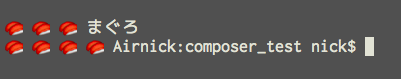

```
{   
    "require":{
        "oh240/osushi": "*"
    }
}
```


```
<?php

require 'vendor/autoload.php';

$sushi = new\Osushi\Osushi();

print $sushi->osushi("お寿司すしすしまぐろ".PHP_EOL);

$sushi->search_word [] = 'まぐろ';

print $sushi->osushi("お寿司すしすしまぐろ");

```


